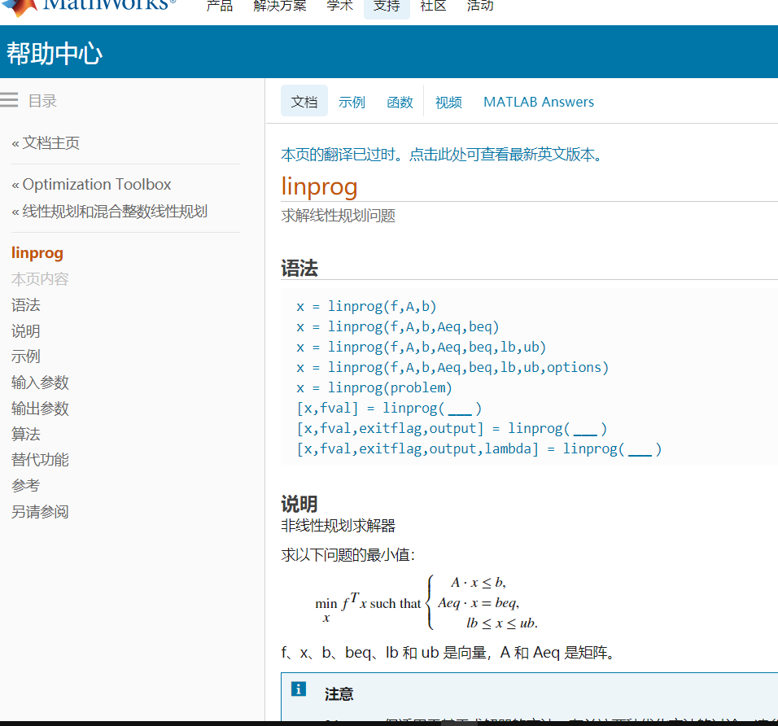
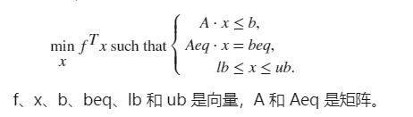
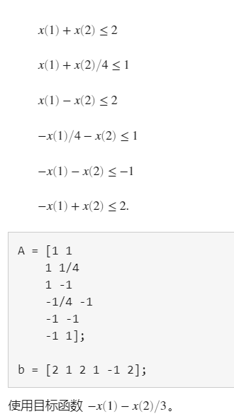

[toc]

# 《数学建模算法与应用》--Charter1 线性规划

## 快速入门

今年报了名参加数学建模国赛，在暑假，开启了我们队伍的学习之旅。学习matlab，我当初踩了不少坑。说实话，matlab不难，相对于python，c，我觉得matlab更易上手。刚开始我想在网上找教程学习，但是，始终找不到适合我的。最后发现，学习matlab的最好方法是查看官方文档（matlab不同版本可能会有差异，但总体差别不大）。

我总结出几个方法：

- 查看官方文档的**快速入门**（有中文）
- 针对某一个函数直接在命令行窗口输入doc <函数名>来查看使用教程

1. 对于查看**快速入门**，可以在主页-帮助-文档中进入，或者按F1

   

   里面就有快速入门的方法，有编程基础的看一看就懂了。

2. 第二种方法，例如，我们要查找**linprog**的用法，我们只需要输入在下方命令行输入doc linprog就会弹出相关教程。不过我的弹出来的是英文的，英语好的可以忽略。但是，如果英语不好的，可以直接百度“linprog mathworks中国”，就会弹出中文教程

   

## linprog用法

用法如下

```matlab
x = linprog(f,A,b)
x = linprog(f,A,b,Aeq,beq)
x = linprog(f,A,b,Aeq,beq,lb,ub)
x = linprog(f,A,b,Aeq,beq,lb,ub,options)
x = linprog(problem)
[x,fval] = linprog(___)
[x,fval,exitflag,output] = linprog(___)
[x,fval,exitflag,output,lambda] = linprog(___)
```




f是目标函数的系数，称为**价值向量**，b为**资源向量**，直接比较理解，我们要结合题目来看。上述中fval为函数值。



```
A = [1 1
    1 1/4
    1 -1
    -1/4 -1
    -1 -1
    -1 1];

b = [2 1 2 1 -1 2];
```

使用目标函数 −*x*(1)−*x*(2)/3。

```
f = [-1 -1/3];
```

求解线性规划。

```
x = linprog(f,A,b)
Optimal solution found.
x = 2×1

    0.6667
    1.3333
```

---

## 例题


```matlab
% 以步长a=0.001 进行循环搜索
clc;
clear;
a = 0;
hold on
while a < 0.05
    c=[-0.05,-0.27,-0.19,-0.185,-0.185];
    A = [zeros(4,1),diag([0.025,0.015,0.055,0.026])];
    b = a * ones(4,1);
    Aeq = [1,1.01,1.02,1.045,1.065];
    beq = 1;
    LB = zeros(5,1);
    [x,Q]=linprog(c,A,b,Aeq,beq,LB);
    Q = -Q;
    plot(a,Q,'*k');
    a = a + 0.001;
end
xlabel('a')
ylabel('Q')
```

## 习题1 课后答案

```matlab
% 第一题
clc;
clear;
c=[3,-1,-1]';
A = [1,-2,1;
    4,-1,-2];
b = [11,-3]';
Aeq = [-2,0,1];
beq = 1;
Lb = zeros(3,1);
[x,fval] = linprog(-c,A,b,Aeq,beq,zeros(3,1));
% c要变成-c,因为linprog求的是最小值，我们要求的是最大值。所以我们将系数变成它的相反数之后，求该函数的最小的，就是原来函数的最大值的相反数。
fval=-fval;
```

```matlab
% 第二题
clc;
clear;
c = [1,2,3,4,1,2,3,4]';
Aeq = [1,-1,-1,1;
       1,-1,1,-3;
       1,-1,-2,3];
Aeq = [Aeq,-Aeq];
beq = [0,1,-1/2]';
[y,z]=linprog(c,[],[],Aeq,beq,zeros(8,1));
x = y(1:4)-y(5:8);
disp(x)
disp(z)
```

**第二题**的关键是我们要知道怎么构造出$|x|$这一个条件
$$
u_i=\frac{x_i+|x_i|}{2},v_i=\frac{|x_i|-x_i}{2}\\
|x_i|=\frac{u_i+v_i}{2},x_i=\frac{u_i-v_i}{2}
$$

