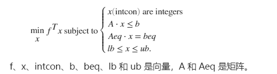

[toc]

# 整数规划

## 求解方法分类

1. 分支定界法——可求纯或混合整数线性规划。
2. 割平面法——可求纯或混合整数线性规划。
3. 隐枚举法——求解“0 - 1”整数规划。
   - 过滤隐枚举法
   - 分支隐枚举法
4. 匈牙利法——解决指派问题（“0 - 1”规划特殊情形）
5. 蒙特卡洛法——求解各种类型规划。


## 整数线性规划的计算机求解(intlinprog)



```matlab
x = intlinprog(f,intcon,A,b)
x = intlinprog(f,intcon,A,b,Aeq,beq)
x = intlinprog(f,intcon,A,b,Aeq,beq,lb,ub)
x = intlinprog(f,intcon,A,b,Aeq,beq,lb,ub,x0)
x = intlinprog(f,intcon,A,b,Aeq,beq,lb,ub,x0,options)
x = intlinprog(problem)
[x,fval,exitflag,output] = intlinprog(___)
```


```matlab
% 例 2.7
clc;
clear;

c = [3,8,2,10,3;8,7,2,9,7;6,4,2,7,5;
    8,4,2,3,5;9,10,6,9,10];
c = c(:);intcon=1:25;
a=zeros(10,25);
for i=1:5
    a(i,(i-1)*5+1:5*i)=1;
    a(5+i,i:5:25)=1;
end
b=ones(10,1);
lb=zeros(25,1);
ub=ones(25,1);
x = intlinprog(c,intcon,[],[],a,b,lb,ub);
x = reshape(x,[5,5]);
```

