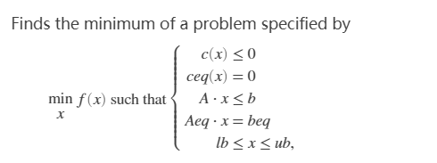
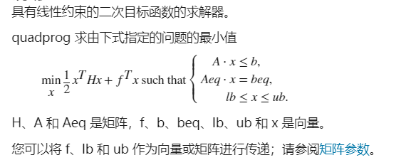

[toc]

# 非线性规划

## 非线性规划的matlab解法

### fmincon函数



```matlab
x = fmincon(fun,x0,A,b)
x = fmincon(fun,x0,A,b,Aeq,beq)
x = fmincon(fun,x0,A,b,Aeq,beq,lb,ub)
x = fmincon(fun,x0,A,b,Aeq,beq,lb,ub,nonlcon)
x = fmincon(fun,x0,A,b,Aeq,beq,lb,ub,nonlcon,options)
% x0是x的初始值，fun是用M文件定义的函数f(x)，nonlcon是M文件定义的非线性向量函数c(x),ceq(x);options定义了优化参数，可以用Matlab默认的参数设置
x = fmincon(problem)
[x,fval] = fmincon(___)
[x,fval,exitflag,output] = fmincon(___)
[x,fval,exitflag,output,lambda,grad,hessian] = fmincon(___)
```

e.g
$$
\min f(x)=x_1^2+x_2^2+x_3^2+8,\\
s.t.= \begin{cases}
x_1^2-x_2+x_3^2 \geq 0,\\
x_1+x_2^2+x_3^3 \leq 20,\\
-x_1-x_2^2+2=0,\\
x_2+2x_3^2=3,\\
x_1,x_2,x_3 \geq 0 。
\end{cases}
$$
对于这道题，我们需要编写三个m文件

```matlab
% filename :'fun1.m'
function f = fun1(x)
f = sum(x.^2)+8;
```

```matlab
% filename :'fun2.m'
function [g,h] = fun2(x)
g = [-x(1)^2+x(2)-x(3)^2
    x(1)+x(2)^2+x(3)^3-20]; % 非线性不等式约束
h = [-x(1)-x(2)^2+2
    x(2)+2*x(3)^2-3]; % 非线性等式约束
```

```matlab
% filename :'main.m'
clear;
clc;
[x,y]=fmincon('fun1',rand(3,1),[],[],[],[],zeros(3,1),[],'fun2');
```

求得当x1=0.5522, x2=1.2033, x3=0.9478时，最小值y=10.6511

### fminsearch函数（求极小值）

$$
f(x)=sin(x)+3
$$

例如我们要求$f(x)$取得极小值时x的值，代码如下

```matlab
% filename :'fun.m'
function f = fun(x);
f = sin(x) +3;
```

```matlab
% filename :'main.m'
x0 = 2;
[x,y] = fminsearch(@ fun,x0)
```

### 计算函数的零点和方程组的解


$$
求多项式f(x)=x^3-x^2+2x-3的零点
$$

#### 法一

```matlab
clear;
clc;
xishu = [1,-1,2,-3];
x = roots(xishu);
```

```
x =

  -0.1378 + 1.5273i
  -0.1378 - 1.5273i
   1.2757 + 0.0000i
```

#### 法二

```matlab
clear;
clc;
syms x
x0 = solve(x^3-x^2+2*x-3);%求函数零点的符号解
x0 = vpa(x0,5); % 化成小数格式的数据，5为有效数字
```

#### 法三

```matlab
clear;
clc;
y = @(x)x^3-x^2+2*x-3;
x = fsolve(y,rand);% 只能求给定初始值附近的一个零点
```

## 约束极值问题

### 二次规划



H为**实对称矩阵**

求解命令

```matlab
x = quadprog(H,f)
x = quadprog(H,f,A,b)
x = quadprog(H,f,A,b,Aeq,beq)
x = quadprog(H,f,A,b,Aeq,beq,lb,ub)
x = quadprog(H,f,A,b,Aeq,beq,lb,ub,x0)
x = quadprog(H,f,A,b,Aeq,beq,lb,ub,x0,options)
x = quadprog(problem)
[x,fval] = quadprog(___)
[x,fval,exitflag,output] = quadprog(___)
[x,fval,exitflag,output,lambda] = quadprog(___)
```

### 罚函数法

利用**罚函数法**，可将非线性规划规划问题的求解，转化为求解一系列无约束极值问题，也可称这种方法为序列无约束最小化技术

思想是利用题目中的约束函数做出适当的罚函数，由此构造出带参数的增广目标函数，把问题转化成无约束非线性规划问题。主要有两种形式，一种叫**外罚函数法**，另一种叫**内罚函数法**

##### 外罚函数法

$$
\min f(x),\\
s.t. 
\begin{cases}
g_i(x) \leq 0,& i=1,\dots,r,\\
h_j(x) \geq0, & j =1,\dots,s,\\
k_m(x)=0, &m=1,\dots,t
\end{cases}
$$

取一个充分大的数M>0，构造函数
$$
P(x,M)=f(x)+M\sum_{i=1}^r \max (g_i(x),0)-M\sum_{j=1}^s \min (h_j(x),0)+M\sum_{m=1}^t |k_m(x)|
$$
在matlab中可以直接利用max,min,sun函数

**注意**：如果非线性规划问题要求实时算法，则可以使用罚函数的方法，但是计算精度较低。

### matlab求约束极值问题

Matlab中用于求解约束最优化问题的函数有

> fminbnd、fmincon、quadprog、fseminf、fminimax

#### fminbnd函数

求单变量非线性函数在区间上的极小值
$$
\min _x f(x),x\in[x_1,x_2]
$$

```matlab
[x,fval]=fminbnd(fun,x1,x2,options)
```

返回值是极小点x和函数的极小值。fun是用M文件定义的函数、匿名函数或Matlab中的单变量数学函数

#### fseminf函数

求
$$
\min f(x),\\
s.t.
\begin{cases}
A \cdot x \leq b,\\
Aeq \cdot x =beq,\\
lb \leq x \leq ub,\\
c(x) \leq 0,\\
ceq(x)\leq 0,\\
K_i(x,\omega_i) \leq 0,1 \leq i \leq n
\end{cases}
$$
c(x), ceq(x)为向量函数；K_i(x, $\omega_i$)为标量函数，$\omega_1,\dots,\omega_n$为附加的便令

Matlab命令格式为

```matlab
[x,fval]=fseminf(fun,x0,ntheta,seminfcon,A,b,Aeq,beq,lb,ub)
```

#### fminimax函数

求解
$$
\min _x \max _i F_i(x),\\
s.t.
\begin{cases}
A \cdot x \leq b,\\
Aeq \cdot x =beq,\\
c(x) \leq 0,\\
ceq(x) = 0,\\
lb \leq x \leq ub,\\
\end{cases}
$$
matlab命令为

```matlab
[x,fval]=fminimax(fun,x0,A,b,Aeq,beq,lb,ub,nonlcon,options)
```


