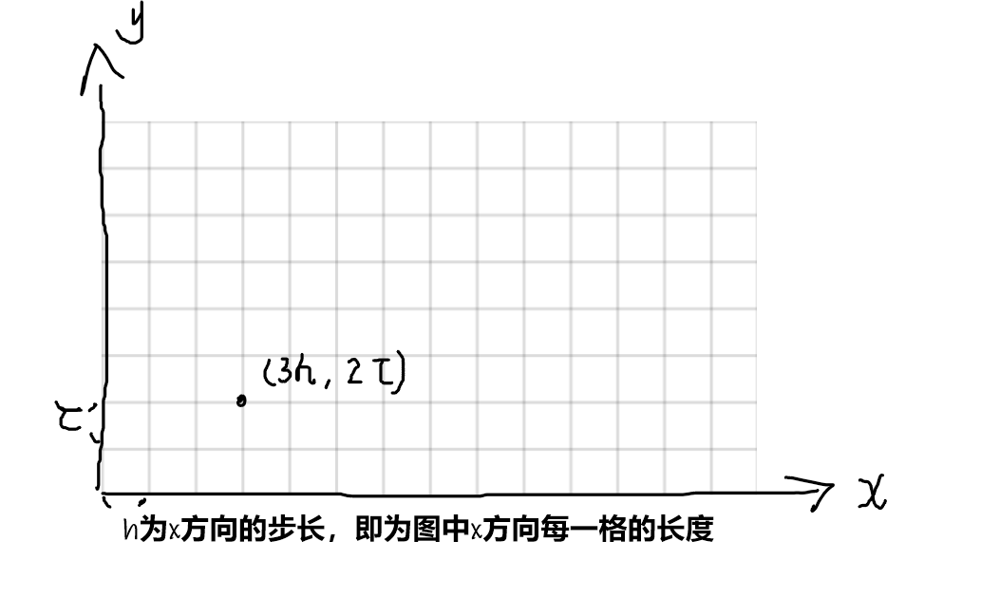

# 差分算法(求解偏微分方程)

## 定义

**差分方法**又称为有限差分方法或网格法，是求偏微分方程定解问题的数值解中应用 最广泛的方法之一。它的基本思想是：先对求解区域作网格剖分，将自变量的**连续**变化 区域用有限**离散点**（网格点）集代替；将问题中出现的连续变量的函数用定义在网格点 上离散变量的函数代替；通过用网格点上函数的差商代替导数，将含连续变量的偏微分 方程定解问题化成只含有限个未知数的代数方程组（称为差分格式）。如果差分格式有 解，且当网格无限变小时其解收敛于原微分方程定解问题的解，则差分格式的解就作为 原问题的近似解（数值解）。因此，用差分方法求偏微分方程定解问题一般需要解决一下问题：

1. 选取网络；
2. 对微分方程及定解条件选择差分近似，列出差分格式；
3. 求解差分格式；
4. 讨论差分格式解对于微分方程解的收敛性及误差估计

## 算法详解


因此，只要确定了步长，我们就可以将**连续变化**的自变量用**有限离散点**来表示



对于(9-3)的式子，为了方便计算，我们用差分来表示偏微分方程
$$
\frac{\partial^2u}{\partial x^2}+\frac{\partial^2u}{\partial y^2}=f(x,y)
$$
由于式子中进行了**两次偏导**，因此我们一步一步进行分析。

进行一次差分，我们用**向前差分**。
$$
\frac{\partial u}{\partial x}=\frac{u(k+1,j)-u(k,j)}{h}
$$
由于向前差分有误差，如果我们进行两次向前差分的话，计算的误差可能会增大，因此，第二次偏导我们选择向后差分。即我们混合向前差分、向后差分来近似代替两次偏导。

因此，第二次我们用**向后差分**
$$
\begin{aligned}
\frac{\partial^2u}{\partial x^2}&=\frac{\partial}{\partial x}(\frac{u(k+1,j)-u(k,j)}{h})\\
& = \frac{\partial}{\partial x}(\frac{u(k+1,j)}{h})-\frac{\partial}{\partial x}(\frac{u(k,j)}{h})
\end{aligned}
$$

$$
\begin{aligned}
\frac{\partial}{\partial x}(\frac{u(k+1,j)}{h})&=\frac{\frac{u(k+1,j)-u(k,j)}{h}\cdot h-0}{h^2}\\
&=\frac{u(k+1,j)-u(k,j)}{h^2}

\end{aligned}
$$

$$
\begin{aligned}
\frac{\partial}{\partial x}(\frac{u(k,j)}{h})&=\frac{\frac{u(k,j)-u(k-1,j)}{h}\cdot h-0}{h^2}\\
&=\frac{u(k,j)-u(k-1,j)}{h^2}
\end{aligned}
$$
综上，
$$
\begin{aligned}
\frac{\partial^2u}{\partial x^2}&=\frac{\partial}{\partial x}(\frac{u(k+1,j)-u(k,j)}{h})\\
& = \frac{\partial}{\partial x}(\frac{u(k+1,j)}{h})-\frac{\partial}{\partial x}(\frac{u(k,j)}{h})\\
&=\frac{u(k+1,j)-u(k,j)}{h^2}-\frac{u(k,j)-u(k-1,j)}{h^2}\\
&= \frac{u(k+1,j)-2u(k,j)+u(k-1,j)}{h^2}
\end{aligned}
$$
同理可得
$$
\frac{\partial^2u}{\partial y^2}=\frac{u(k,j+1)-2u(k,j)+u(k,j-1)}{\tau^2}
$$
所以原方程就变为
$$
\frac{\partial^2u}{\partial x^2}+\frac{\partial^2u}{\partial y^2}=f(x,y)\\
\frac{u(k+1,j)-2u(k,j)+u(k-1,j)}{h^2}+\frac{u(k,j+1)-2u(k,j)+u(k,j-1)}{\tau^2}=f(x,y)
$$
以上的进行通过混合向前差分、向后差分的方法求二阶偏导的方法实际上就是**二阶中心差分**


## 常见的差分

### 向前差分

函数的前向差分通常简称为函数的差分。对于函数f(x)，如果在等距节点：
$$
x_k=x_0+kh(k=0,1,\cdots,n)
$$

$$
\Delta f(x_k)=f(x_{k+1})-f(x_k)
$$


则称Δf(x)，函数在每个小区间上的增量$$y(k+1)-y(k)$$为f(x)的一阶前向差分。在微积分学中的有限差分（finite differences），前向差分通常是微分在离散的函数中的等效运算。差分方程的解法也与微分方程的解法相似。当是多项式时，前向差分为Delta算子，一种线性算子。前向差分会将多项式阶数降低1

### 向后差分

对于函数$f(x_k)$，一阶向后差分为：
$$
\Delta f(x_k)=f(x_k)-f(x_{k-1})
$$

### 中心差分

对于函数$f(x_k)$，一阶中心差分为:
$$
\Delta f(x_k)=\frac{1}{2}(f(x_{k+1})-f(x_k))
$$


## 例题

用五点菱形个格式求解Laplace方程第一边值问题
$$
\begin{cases}
\frac{\partial^2u}{\partial x^2}+\frac{\partial^2u}{\partial y^2}=0,&(x,y)\in \Omega\\
u(x,y)|_{(x,y)\in \Gamma}=\lg [(1+x)^2+y^2],&\Gamma=\partial \Omega,
\end{cases}
$$
其中$\Omega=\left\{ (x,y)|0 \leq x,y \leq 1 \right\}$，取$h=\tau=\frac{1}{3}$

**解：**


根据题意，我们画出网格出来，正好构成四个五点菱形，即得到四个方程，我们将线性方程组写出来
$$
\begin{cases}
\frac{1}{h^2}(u_{1,2}+u_{2,1}+u_{1,0}+u_{0,1}-4u(1,1))=0\\
\frac{1}{h^2}(u_{2,2}+u_{3,1}+u_{2,0}+u_{1,1}-4u(2,1))=0\\
\frac{1}{h^2}(u_{1,3}+u_{2,2}+u_{1,1}+u_{0,2}-4u(1,2))=0\\
\frac{1}{h^2}(u_{2,3}+u_{3,2}+u_{2,1}+u_{1,2}-4u(2,2))=0
\end{cases}
$$
线性方程组又可以化简成
$$
\begin{bmatrix}
-4 & 1 &1 &0 \\
1 & -4 & 0 & 1 \\
1 & 0 & -4 & 1\\
0 & 1 & 1 & -4
\end{bmatrix}
\begin{bmatrix}
u_{1,1}\\
u_{1,2}\\
u_{2,1}\\
u_{2,2}
\end{bmatrix}=-
\begin{bmatrix}
u_{1,0}+u_{0,1}\\
u_{3,1}+u_{2,0}\\
u_{1,3}+u_{0,2}\\
u_{2,3}+u_{3,2}
\end{bmatrix}
$$


解非齐次线性方程组求得：
$$
u_1=0.6348,
u_2=1.06,
u_3=0.7985,
u_4=1.1698
$$
计算的MATLAB程序如下

```matlab
clc;
clear;
f1 = @(x)2 * log(1+x);
f2 = @(x)log((1+x).^2+1);
f3 = @(y)log(1+y.^2);
f4=  @(y)log(4+y.^2);
u=zeros(4);
m=4;% 总列数
n=4;% 总行数
h=1/3;
u(1,1:m)=feval(f3,0:h:(m-1)*h)';
u(n,1:m)=feval(f4,0:h:(m-1)*h)';
u(1:n,1)=feval(f1,0:h:(n-1)*h);
u(1:n,m)=feval(f2,0:h:(n-1)*h);
b = -[u(2,1)+u(1,2);u(4,2)+u(3,1);u(2,4)+u(1,3);u(3,4)+u(4,3)];
a = [-4,1,1,0;1,-4,0,1;1,0,-4,1;0,1,1,-4];
x=a\b;
```

**代码解读**

观察线性方程：
$$
\begin{bmatrix}
-4 & 1 &1 &0 \\
1 & -4 & 0 & 1 \\
1 & 0 & -4 & 1\\
0 & 1 & 1 & -4
\end{bmatrix}
\begin{bmatrix}
u_{1,1}\\
u_{1,2}\\
u_{2,1}\\
u_{2,2}
\end{bmatrix}=-
\begin{bmatrix}
u_{1,0}+u_{0,1}\\
u_{3,1}+u_{2,0}\\
u_{1,3}+u_{0,2}\\
u_{2,3}+u_{3,2}
\end{bmatrix}
$$
这个形式为最小二乘法的形式

参考Matlab中的线性最小二乘的标准型：
$$
\min _A \Vert RA-Y \Vert_2^2
$$
所以我们只需要求出等式右边的式子，那么我们就可以解出等式中间的向量

现在我们来解等式右边的向量，观察可知，为定义域的边界

注意这里从1开始，与上式子有些不同
$$
\begin{bmatrix}
u_{1,1} & u_{1,2} & u_{1,3} & u_{1,4}\\
u_{2,1} & u_{2,2} & u_{2,3} & u_{2,4}\\
u_{3,1} & u_{3,2} & u_{3,3} & u_{3,4}\\
u_{4,1} & u_{4,2} & u_{4,3} & u_{4,4}
\end{bmatrix}
$$
因此我们只需要解出边界的值，就可以把b表示出来

